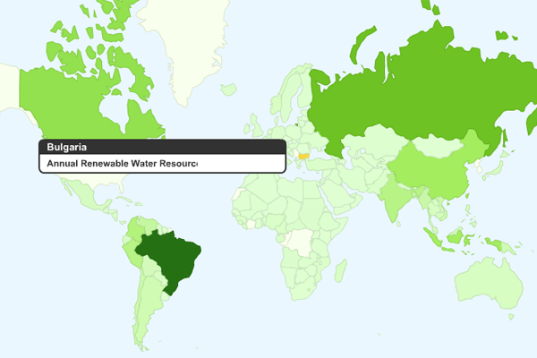

Fusion Tables е услуга за управление на големи колекции от таблична
информация в т. нар. облак. Можете да качвате таблици големи до 100 МБ и
да ги споделяте със сътрудници или да ги публикувате за всички. На
таблиците могат да бъдат прилагани филтри и агрегиране на информацията,
която може да бъде визуализирана на географската карта. Информацията
също може да бъде смесвана с други таблици или да се експортира в уеб
формати и CSV файлове. Можете да дискутирате таблиците на различни нива.

Това беше долу-горе преводът на описанието на услугата в Google Labs.

Аз само мога да добавя, че ако човек се позарови, може да се види, че
възможностите на услугата са доста големи. Върху таблиците могат да
бъдат прилагани различни филтри, които могат да бъдат визуализирани по
различни начини, например по картата, по картата с интензитет, като
графика или pie chart.

[http://tables.googlelabs.com](http://tables.googlelabs.com)
