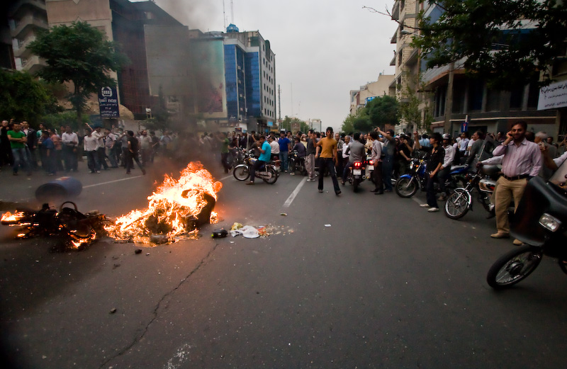

Събитията последвали оспорваните избори в Иран създадоха почва за
сериозна дискусия на тема как новините от горещите точки на света идват
до нас и начинът, по който се отразяват в Интернет. Дори влиятелният "Ню
Йорк Таймс" излезе със статия озаглавена "[Dear CNN, Please Check
Twitter for News About
Iran](http://www.nytimes.com/external/readwriteweb/2009/06/14/14readwriteweb-dear-cnn-please-check-twitter-for-news-abou-45130.html)"
- провокативно и обобщително заглавие от една водеща медия към друга
такава.

Очевидно голям брой хора, потребители на социалните сайтове Twitter и
Flickr са се зачудили защо часове след като развитието на събитията в
Иран е поело критичен обрат, сайтът на CNN, новинарската организация
смятана за длъжна да информира света за всички събития от тази величина
по целия свят, е бил ням за това което става в Ислямската република. И
все пак хора от Иран, вероятно хора подръжници на "изгубилия" кандидат
за президент Мусави, са направили всичко възможно да се появи в
Интернет, това което реално се случва по улиците на иранските градове от
това време.

Още по-интересно става като се добави фактът, че властите в Иран са
направили всичко възможно за да заглушат всякаква електронната
комуникация с външния свят - достъпът към някои от популярните социални
мрежи е бил прекъснат, а също така са били нарушени и мобилните
комуникации, а сайтът на Мусави е бил недостъпен (според публикации).
Още по темата: [Iran protesters using tech to skirt
curbs](http://news.cnet.com/8301-1023_3-10264634-93.html?part=rss&subj=news&tag=2547-1_3-0-5).

Фотография: [Шахрам Шариф](http://www.flickr.com/photos/sharif/)

Победата на Ахмадинеджад очевидно набързо е била призната от другите
власти въпреки протестите на останалите участници в изборите - хора с
по-либерални възгледи. Лидери на опозицията са арестувани, а
"новоизбраният президент" по-късно заявява, че не може да гарантира
сигурността на основния си конкурент.

Освен, че подръжниците на Мусави са направили всичко възможно свободата
на словото да не бъде напълно убита от властите в Иран като са
използвали Интернет на своя страна, странно е било мълчанието на сайта
на CNN по това време. Водещият на CNN [Рик
Санчес](http://twitter.com/ricksanchezcnn) съобщил в туитър акаунта си,
че покривал събитието по телевизионния канал и може би само сайтът на
медията не е бил в час със случващото се в Техеран.

От всичко това бих могъл да направя заключението, че сайтовете на
традиционните медии са важни източници на информация, на които се
разчита да са поне също толкова бързи в информирането като традиционните
средства за информация. Също така, че социалните медии дават възможност
на потребителите си да правят своя собствена журналистика като
публикуват снимки, видео и новини от мястото на събитията в реално време
- това е относителна успешна медия, но със сигурност по-трудно достигаща
до множеството хора търсещи новини, което донякъде се е компенсира с
привлеченото внимание върху потребителските профили отразяващи
събитията.

Очевидно ако традиционните медии се провалят по един или друг начин да
информират, се появяват достатъчно интернет потребители, които да го
направят, нещо което вече се наблюдава и в България.

**Обновление (01:10 17.6.2009)**: Темата за социалните медии и изборите
в Иран търпи развитие. Според блог постове на един от основателите на
Twitter и на един от блоговете на CNN, държавният департамент на САЩ
(МВнР) е настоял планираната голяма и важна профилактика на социалната
мрежа да бъде отложена за да може информацията от Иран да продължава да
тече. Повече по темата на следните линкове:

-   [State Department to Twitter: Keep Iranian tweets
    coming](http://ac360.blogs.cnn.com/2009/06/16/state-department-to-twitter-keep-iranian-tweets-coming/)
-   [Twitter downtime gets delayed for Iranian election
    news](http://news.cnet.com/8301-17939_109-10265213-2.html)
-   [IRAN: Twitter, NTT America hold off maintenance to keep channel
    clear](http://latimesblogs.latimes.com/babylonbeyond/2009/06/iran-twitter-ntt-america-hold-off-maintenance-to-keep-iran-channel-clear.html)

