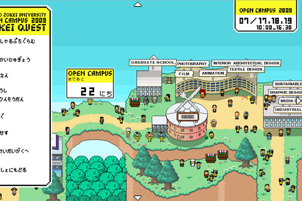

Токийският университет **Zokei**, където студентите специализират
графичен дизайн, наскоро са пуснали [много готин
сайт](http://www.zokei.ac.jp/opencampus/index.html), с който рекламират
себеси пред завършващите училище. Сайтът представлява не само
университетското градче в 8-битова графика, но и РПГ-игра.

През
[offworld](http://www.offworld.com/2009/06/one-shot-tokyo-zokei-universit.html).
