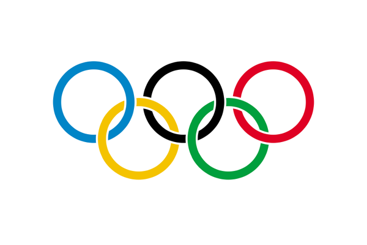

Услуги като туитър и фейсбук определено набират скорост, ако се вземе
предвид, че главата на една от най-могъщите информационни агенции е
говорил как те и потребители им променят правилата на играта за
разпространението на новини.

Нещо показателно се е случило, макар и да е далеч от затъналата в
политически и изборни неволи България: В [статия на
paidContent](http://paidcontent.org/article/419-reuters-tells-olympics-reform-media-rules-for-the-twitter-age)
е цитиран главния редактор на световната информационна агенция Ройтерс
(Reuters) Дейвид Шлезингер (David Schlesinger), който е предупредил Прес
Комисията към Международния Олимпийски Комитет, че правилата и за
медийни акредитации са остарели и трябва да бъдат модернизирани за да
позволят на членовете на зрителите да съобщават от Игрите.

"Старите методи на контрол не работят ... В основата си старите медии
няма да контролират разпространението на новини в бъдещето. А
организациите вече няма да могат да контролират достъпа като използват
старите форми на акредитация". Така заявил по време на реч [според
публикация в Press
Gazette](http://www.pressgazette.co.uk/story.asp?sectioncode=1&storycode=43857&c=1).

"Трябва да се справяме с почти невъзможния въпрос за това кой е
журналист и какво значи публикуване на новина". Резултатите от Лондон
2012 няма да бъдат пускани първо по големите информационни агенции, а от
"потребители на туитър (б.пр. Twitter), които седят на стандионите и
тракащи резултата в туит съобщения на мобилния си телефон. Това означава
да работим заедно с публиката, разполагаща с мобилни телефони, цифрови
камери и други мултимедийни възможности, а не против нея".

“You need to deal with the almost impossible question of who is a
journalist, and what does it mean to report.” Results from London 2012
will come first not from the big wires by from “Twitterers sitting in
the stadium banging out the result in a tweet from their mobile phone.
It means working with the mobile phone and digital camera and
media-enabled public, and not against them.”
