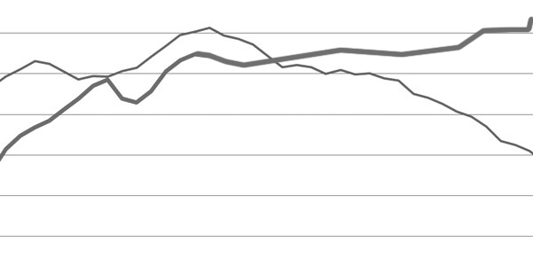

Том Форемски, бивш журналист от "Файненшъл Таймс", [отразява интересен
(според мен - очевиден)
пример](http://www.siliconvalleywatcher.com/mt/archives/2009/06/scobleizer_traf.php)
в блога си за това как мрежата в реално време може да навреди на лични
сайтове преди всичко.

Според него социални сайтове като **туитър**(Twitter) и
**френдфийд**(FriendFeed) могат да получат толкова внимание от даден
автор, че той да не се грижи достатъчно за личния си сайт или блога
си. Това "занемаряване" от своя страна води до пускане на нови постове
със същите достоинства като предишните все по-нарядко, а това - до
отслабен интерес от страна на читателите.

В даденият пример става дума за сайта на **Робърт Скобъл**, който
(според данни на Compete.com), би трябвало да е отчел срив на месечния
си трафик от март до май 2009 с около 50%, или от около 181 000 уникални
потребители на месец е паднал на 91 792. Ако се включат данните от юни,
спадът би трябвало да е 75% процента според Форемски.

Фактите говорят.
