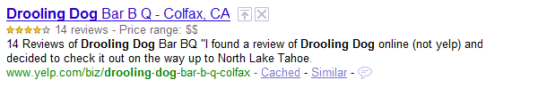

(Следва превод от Йордан Дичев на статията [Introduction to
RDFa](http://www.alistapart.com/articles/introduction-to-rdfa/)
публикувана в [A List Apart](http://www.alistapart.com/). За неточности:
jordan.dichev@gmail.com)

от Марк Бърбек^\*\*^

RDFa (Resource Description Framework in attributes) получи своите пет
минути слава: Google започна да обработва RDFa и Microformats като част
от индексирането на сайтовете, използвайки прочетената информация за да
подобри показването на резултатите от търсене с т.нар. „rich snippets“
(б. пр. богати прегледи). Междувременно Yahoo! натрупа една година опит
в обработването на RDFa. С тези два гиганта в технологиите за търсене,
един нов вид уеб изглежда по-близо от всякога.

Мрежата е проектирана да се ползва от хора и повечето от пълноценната и
полезна информация, която нашият сайт съдържа, е недостъпна за машините.
Хората могат да се справят със всички видове подредба: правопис,
големина на буквите, цвят, позиция и т.н. и да все пак да възприемат
желаното значение от уеб страницата. От друга страна машините имат нужда
от малко помощ.

Един нов вид мрежа, семантичен уеб, ще бъде създадена от информация,
която е маркирана по такъв начин, че софтуерът да може лесно да я
разбира. Преди да се прецени как може да се постигне такъв уеб, нека да
погледнем към това, което може да се прави с него.

### Подобрено търсене

Добавянето на информация, която е лесна за разбиране от машините,
подобрява нашите възможности за търсете. Представете си новинарска
статия, която съобщава „днес премиерът отлетя за Австралия“, като става
дума за премиера на Велкобритания Гордън Браун. Новината може да не
нарича премиера с името му, но все пак е достатъчно лесно да се направи
така, че статията да се появи в резултатите от търсене за „Гордън
Браун“.

Ако обаче статията, за която говорим, датира от 1940 г., ние не бихме
искали този документ да се появи когато потребителят търси за „Гордън
Браун“. Наместо това ние бихме искали статията да се открива с търсене
за „Уинстън Чърчил“.

За да се постигне това като се използва същата техника като в примера с
Гордън Браун, например да се свърже една комбинация от думи с друга,
нашата търсачка трябва да знае датите между които са били мандатите на
британските премиери и след това да направи заключение базирано на
датата на новината. Това би било напълно невъзможно ако например
статията е измислена или става дума за премиера на Австралия. В тези
случаи един обикновен списък от дати не би бил полезен.

Алгоритмите за индексиране, които се опитват да отделят необходимото
съдържание от текста, със сигурност ще се подобрят през следващите
години, но допълнителното маркиране, които прави информацията
недвусмислена, може да да направи търсенето по-точно.

### Подобрени потребителски интерфейси

Yahoo! и Google са започнали отдавна да използват RDFa за да подобрят
потребителското изживяване (б.пр. user experience) като се подобри
показването на индивидуалните резултати от търсене. Ето как Гугъл прави
това.

Пълноценен преглед в Google\

Ето го и резултатът от Yahoo!

Пълноценен преглед в Yahoo!

---

Съществува търговско предимство от това да има едно по-добро „разбиране“
на страниците, които се индексират: по-релевантни, по-фокусирани реклами
могат да се покажат до резултатите от търсене.

Сега като знаем, че е възможно да добавим повече информация разбираема
от машините на нашите страници, можем да се запитамее какво можем да
направим по въпроса.

### Възможностите на HTML за мета-данни

Без съмнение вече сте запознати с основните възможности за мета-данни,
които HTML поддържа. Най-често ползваните са `meta `и `link `елементите,
а някои може би знаят, че `@rel` атрибута на `link `елементите може да
се ползва и с `а` таговете. (Бележка: ще използвам термина „HTML“ за да
означа семейството от HTML езици, тъй като това, за което говоря важи
еднакво за HTML и XHTML.)

Първо ще погледнем тези съществуващи възможности, защото те задават
концептуалната основа, върху която RDF е създаден.

### Използването на `meta `и `link `в HTML

`Meta` и `link` елементите са разположени в head елемента на даден
документ и ни позволяват да дадем информация, която се отнася към
документа. Например бих поискал да съобщя, че съм създал документа на 9
май 2009, че аз съм авторът му и че позволявам на други хора да ползват
материала както намерят за добре:

`<html><head> <title>RDFa: Now everyone can have an API</title> <meta name="author" content="Mark Birbeck" /> <meta name="created" content="2009-05-09" /> <link rel="license" href="http://creativecommons.org/licenses/by-sa/3.0/" /></head>...</html>`

Този пример показва как HTML елегантно опакова мета-данните на документа
на отделно от текста на документа място. HTML използва head елемента за
мета-данните и `body `елемента за всичко това, което се съдържа в
страницата.

HTML също така позволява да смесим тези две зони: можем да използваме
`@rel` атрибута във връзка, върху която може да се кликва, и все пак да
запазим значението, което се съдържа във връзката.

### Използване на `@rel`

Представете си, че искам да позволя на посетителите на сайта ми да
виждат моя Creative Commons лиценз. При това положение на нещата
информацията за това към кой лиценз се отнася съдържанието на
страницата, тъй като тази информация е в head елемента. Това може лесно
да се поправи като се сложи a елемент в body.

`<a href="http://creativecommons.org/licenses/by-sa/3.0/">CC Attribution-ShareAlike</a>`

Това е добре и ни позволява да постигнем целите си: на първо място имаме
информация предназначена за машините в `head `елемента която описва
взаимоотношението между документа и лизенза:

`<link rel="license" href="http://creativecommons.org/licenses/by-sa/3.0/" />`

и на второ място имаме връзка в `body` елемента, която позволява на
човек да я последва и да прочете лиценза:

`<a href="http://creativecommons.org/licenses/by-sa/3.0/">CC Attribution-ShareAlike</a>`

HTML също така обаче ни позволява да ползваме `@rel` атрибута с
`link `или `a` елементите. С други думи, това са мета-данни, които в
друг случай биха се съдържали в `head` елемента да се появят в `body`.

С тази невероятно мощна техника, можем да изразим едновременно
мета-данни за машините и активна връзка за хората в една подходяща
опаковка.

`<a rel="license" href="http://creativecommons.org/licenses/by-sa/3.0/">CC Attribution-ShareAlike</a>`

Този обикновен метод на подобряване на маркъпа с мета-данни е доста
рядко използван в уеб страниците, но е част от сърцевината на RDFa. Това
обяснява първия принцип на RDFa:

### Правило 1:

`Link `и `a `елементите внушават че има взаимодействие между настоящия
елемент и други документи. `@rel` атрибутът ни позволява да добавим
стойност, която описва взаимодействието.

Но не забравяйте: използването на `@rel` е не повече от това да се
използва една вече съществуваща функционалност в HTML, върху която
(б.пр. темата на тази статия) RDFа въведението привлича нашето внимание.

### Прилагане на отделни лицензи към картинки

Горният пример дава информация за лиценза за страницата, която го
съдържа. Но какво би станало ако страницата съдържа определен брой
елементи, всеки от които има различен лиценз? Не е нужно повече от
секунда за да се сетим за сценарии към които това се отнася като
например резултати от търсене във Flickr, YouTube или SlideShare.

RDFa взема обикновената идея, която обяснява `@rel` - че този атрибут
изразява взаимоотношение между две неща - и използва това като позволява
атрибутът да се прилага към `@src` атрибута на `img `елементита.

Така например да си представим страница с резултати във Flickr.

``

Да речем че първата картинка е лицензирата под Creative Commons
Attribution-ShareAlike лиценз, а втората използва Creative Commons
Attribution-Noncommercial-No Derivative works лиценза.

Как да маркираме това?

Ако сте се досетили, че просто трябва да поставим `@rel` атрибут на img
елемента, сте напълно прави. За да се изразят отделните лицензи с всяка
картинка трябва да се направи следното:

``

Тук може да се види принципът в действие - постепенни подобрения на
базата на възможностите за мета-данни, които HTML предлага. Подобни
подобрения на базата на HTML позволяват на хората, които ползват RDFa,
да се ориентират по-лесно.

### Правило 2:

`@rel` и `@href `атрибутите вече не са обвързани с `a` и
`link `елементите и могат също така да се използват с `img `за да
означат взаимовръзка между картинка и нещо друго.

### Добавяне на свойства на `body`

В HTML примера видяхме, че можем също така да добавяме текстови свойства
относно документа.

`<meta name="author" content="Mark Birbeck" /><meta name="created" content="2009-05-01" />`

Те ни информират кой и кога е създал документа, но могат да бъдат
ползвани само в `head `на документа. RDFa също така използва тази
техника за да я промени така, че тя да се ползва в `body`-то. `@content`
по този начин вече не е обвързан с `meta `таг-а и може да се появи във
всеки един елемент.

### Правило 3:

В обикновения HTML свойствата са попълнени в `head `елемента на
документа, чрез използването на `@content` атрибута. В HTML документ с
RDFa `@content` може да се прилага към всеки един елемент.

Има малка промяна в начина, по който `@content` се използва в
`head `обаче поради факта, че `@name` атрибутът е вече използван с
различно предназначение в други части на HTML и би било объркващо да го
използваме по същия начин в body. RDFa по този начин дава нов атрибут
наречен `@property`, който да играе тази роля.

### Правило 4:

Въпреки, че HTML ползва `@name` свойството за да зададе име на свойство
в `meta `таг, то не може да се използва и в други елементи, така че RDFa
въвежда нов атрибут наречен `@property`.

Да предположим, че датата на публикуване и името на автора на нашия
документ са в `head `на документа, и че същата информация е възможно да
бъде прочетена от човек в `body `на елемента.

`<html><head> <title>RDFa: Now everyone can have an API</title> <meta name="author" content="Mark Birbeck" /> <meta name="created" content="2009-05-09" /></head><body> <h1>RDFa: Now everyone can have an API</h1> Author: <em>Mark Birbeck</em> Created: <em>May 9th, 2009</em></body></html>`

С помощта на RDFa можем да обединим тези две единици информация така че
мета-данните да се намират на същото място, на което е и текстът за
четене.

`<html><head> <title>RDFa: Now everyone can have an API</title></head><body> <h1>RDFa: Now everyone can have an API</h1> Author: <em property="author" content="Mark Birbeck"> Mark Birbeck</em> Published: <em property="created" content="2009-05-09"> May 14th, 2009</em></body></html>`

След малко ще видим как момже да подобрим този пример. За сега просто
трябва да разберем, че в зависимост от това дали мета-данните се намиран
в `body `или `head `на елемента, това значи едно и също нещо, и че това
е еквивалентът като текстово свойство на `@rel `техниката, която HTML
вече има за изазяване на взаимоотношения в `body`.

### Използване на речници

Тук трябва малко да се отклоним. Можем спокойно да ползваме
`@name="author"` в `head `на документа тъй като въпреки, че свойството
"author" не е дефинирано в никоя спецификация, хората започнаха да ко
очакват през последните години. Само че RDFa позволява, и изисква, доста
по-голяма точност. Когато използваме термин като "author" или "created",
ние трябва да покажем откъде идва терминът. Ако не го направим, няма как
да знаем, че значението на "author" е това, което имам предвид.

Възможно е това да изглежда ненужно. Все пак как би могъл някой да се
обърка за значението на очевиден термин като "author"? Но представете
си, че терминът "country" (б.пр. държава, провинция) се използва на сайт
за почивки. Терминът показва ли, че почивката е в провинцията или в
град? Много други думи имат различни значения в различни контексти и ако
към това се добави възможността да бъде използван различен език, скоро
ще осъзнаете, че ако искаме да направим какъвто и да е напредък с нашите
данни, трябва да бъдем точни. А това значи да означим откъде идват
термините, които използваме.

В RDFa това се прави като посочваме, че искаме да ползваме определена
колекция от термини, или речник. Това е лесно да се направи - просто
добавете адреса на речника в комбинация със съкратен указател както
следва:

`xmlns:dc="http://purl.org/dc/terms/"`

(Ако сте запознати с XML, ще разпознаете това като синтаксис за
декларация на неймспейс.)

Този пример ни дава достъп до списък с термини от Dublin Core речника,
посреднством префикса "dc". Dublin Core има доста термини, които са на
разположение и двата, които ползваме в нашия пример са "creator" и
"created". За да ги приведем в действие, трябва да сложим префикс-а пред
тях по следния начин:

`dc:creatordc:created`

Сега е абсолютно ясно: “dc:creator” не е същото като “`xyz:creator`”.

Забележете, че префиксният указател трябва да бъде добавен в документа
някъде преди това място, където се ползва. В нашия пример може да бъде
направено в `body `елемента или `html `елемента. Пълният пример би
изглеждал така:

`<html xmlns:dc="/"> <head> <title>RDFa: Now everyone can have an API</title> </head> <body> <h1>RDFa: Now everyone can have an API</h1> Author: <em property="dc:creator" content="Mark Birbeck"> Mark Birbeck</em> Published: <em property="dc:created" content="2009-05-09"> May 9th, 2009</em> </body></html>`

Има много други речници, от които да се избира и ще спомена някои от тях
в следващата статия от серията. Разбира се нищо не може да ви спре от
откриване на свои собствени за употреба във вашата компания, организация
или група по интереси. Но отбележете едно нещо, което често изненадва
хората: няма централна организация да контролира работата ви. Има добри
практики, които трябва да се спазват. Въпреки това, със възможностите
идват и отговорнистта, така че бъдетопитайте се да разберете колкото
може повече за процеса преди да започнете да работите върху нов речник.

Преди да се върнем към примера, трябва да добавя още едно пояснение
относно речниците тъй като вие със сигурност ще се чудите защо
`@rel="licence`" не се приема по същия начин както `@property="author"`
и изисква префикс. Отговорът е, че HTML вече има някои вградени
стойности ползвани с `@rel` (като например "next" и "prev"), RDFa добавя
някои нови. Един от онези добавени от RDFa са "license".

Веднъж готови да излезете от този списък със стойности, например за да
ползвате термин от Dublin Core речника като например "replaces" или
термин от FOAF като "knows", тогавав трябва да използвате префикс
указател по абсолютно същия начин по който го направихме за `@property`.

Например да речем, че статията ни има не само CC лиценз както видяхме
преди това, но и също замества друг елемент - връзка, която можем да
изразим като използваме "replaces" термина на Dublin Core. Изразяваме
такива взаимоотношения по следния начин:

`<html xmlns:dc="http://purl.org/dc/terms/"> <head> <title>RDFa: Now everyone can have an API</title> </head> <body> <h1>RDFa: Now everyone can have an API</h1> Author: <em property="dc:creator" content="Mark Birbeck"> Mark Birbeck</em> Created: <em property="dc:created" content="2009-05-09"> May 9th, 2009</em> License: <a rel="license" href="http://creativecommons.org/licenses/ » by-sa/3.0/"> CC Attribution-ShareAlike</a> Previous version: <a rel="dc:replaces" href="rdfa.0.8.html"> version 0.8</a> </body></html>`

Сега като разбрахме речниците, нека да се върнем към основният ни
пример.

### Употреба на текст за задаване стойност на свойство

В предишния пример, дублирането на текста “Mark Birbeck” в `@content`
атрибута и текста може да ви е грабнало. Ако да, стигурно вече ви се
иска да потанцувате с RDFa. Естествено, че можем да махнем `@content`
стойността ако текста съдържа стойността, която искаме да използваме за
мета-данни:

`Автор: <em property="dc:creator">Mark Birbeck</em>`

### Правило 5:

Ако няма `@content `атрибут, тогава стойността на свойството ще бъде
присвоена от текста на елемента.

Въпреки, че `@content` техниката произлиза от `meta` елемента на HTML,
мислете за последния пример като за "метод по подразбиране" за задаване
на свойство. Задаването на `@content` атрибут може да бъде начин да се
запише съдържание различно от текстовото съдържание, ако не казва точно
каквото искате. Това също позволява на авторите да правят повече неща
отколкото с наличния текст предназначен за потребителите, тъй като могат
да бъдат по-точни с вградената допълнително информация. Датата на
публикуване илюстрира това; цялата информация в предходния пример има
едно и също значение, и вса пак доста различно показване на читателя.

`May 14th, 2009May 14th14th May14/05/09tomorrowyesterday14 Mai, 200914 maggio, 2009`

### Правило 6:

Ако `@content` атрибутът присъства той презаписва стойността на текста
съдържан елемента в стойността на свойството.

В следващото издание на ALA ще научим как да добавяме свойства към
картинка и как да добавяме метаданни към всяко от тях.

---

^\*^ Translated with the permission of [A List Apart
Magazine](http://www.alistapart.com/) and the author[s].

^\*\*^ Марк е изпълителен директор на [Backplane
Ltd.](http://webbackplane.com/), компания базирана в Лондон и занимаваща
се с някои RDFa/linked data проекти за правителствени органи на
Обединеното кралство. Той първоначално е предложил RDFa и ще говори за
RDFa и семантичния уеб в  [free Skills Matter
seminar](http://webbackplane.com/mark-birbeck/blog/2009/06/rdfa-seminar)
в Лондон на 13 юли т.г.
