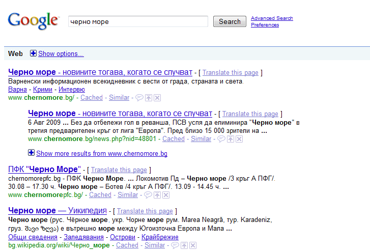

[Някои
хора](http://googlesystem.blogspot.com/2009/08/google-sitelinks-for-wikipedia.html)
[са забелязали](http://blogoscoped.com/forum/159189.html), че Google са
започнали да показват нови видове сайтлинкове (допълнителни връзки) към
резултатите от търсене идващи от Уикипедия, но също така и от някои
други сайтове.

Според търсачката сайтлинковете са допълнителни резултати, които са
продукт на анализ на структурата на връзките в даден сайт, целящи да
улеснят достъпа на потребителя към някои секции в сайтовете, които биха
им били от полза.

По-долу и един скрийншот от мен. Новите сайтлинкове могат да се видят в
резултатите от chernomore.bg и bg.wikipedia.org.

