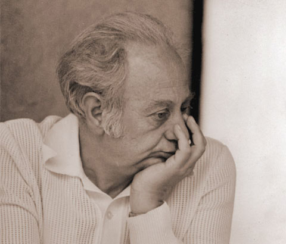

 

[Стефан Кънчев](http://www.stefankanchev.com) има [статия посветена на
творчеството му в
COLOURlovers](http://www.colourlovers.com/blog/2009/09/07/the-colors-of-stefan-kanchev).
Творчеството му е особено подходящо за сайт като на влюбените в
цветовете. Следя какво излиза там и мога да кажа, че не са много
личностите, които присъстват там самостоятелно.

Приятно четене, а ако някой не знае кой е Стефан Кънчев, може би от
родените след 1989, ето малко повече информация от сайта на твореца
направен от добри хора.

> КЪНЧЕВ, Стефан Киров — график-приложник, народен художник (1971).
> Роден на 6.VIII.1915, Калофер. Син на иконописец. Учи (1940–1945)
> стенопис в Художествената Академия, София, при проф. Дечко Узунов.
> Работи във всички области на приложната графика. Автор е на много
> корици на книги с народни приказки, плакати, запазени фабрични и
> търговски марки, новогодишни и др. честитки, рекламни страници,
> луксозни бланки и писма, пощенски марки, етикети, опаковки и др.
> Творчеството му, за което черпи идеи и мотиви от народната традиция,
> се отличава с богато въображение, спокойна и ясна композиция,
> сполучлива връзка между шрифт и образ, изчистени форми, оригинални
> художествени идеи, които напълно изчерпват съдържанието на творбата. В
> цветните творби също ясно се проявява неговото голямо професионално
> майсторство. От 1945 участва в много изложби и биеналета в България и
> в чужбина: Белград, Будапеща, Берлин, Москва, Варшава, Бърно, Любляна,
> Ню Йорк — I световна изложба на запазената марка; участва с 23 творби
> от всичко 250 от цял свят, и др. Урежда самостоятелни изложби в София,
> Москва, Прага, Берлин, Варшава, Будапеща, юбилейна изложба в София
> (1975). Печели многократно конкурси за шрифт, плакат, запазени марки,
> честитки, телеграми, оформяне на книги и др. произведенията му се
> ползват със световна известност и името му фигурира в най-големите
> енциклопедии по приложна графика. Награден е с ордените „Кирил и
> Методий” — I степен (1956, 1963, 1969), „Червено знаме на труда”
> (1965), „Народна република България” — II степен (1975). Наградата за
> плакат и приложна графика „Александър Жендов” (1973) и др.

Източник: Енциклопедия на изобразителното изкуство в България, София,
1981г.
