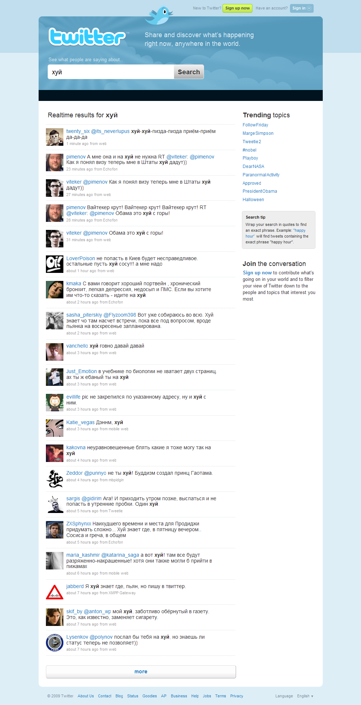

Реших да погледна какво хората из туитър наричат „хуй“ и „кур“ из така
интересните резултати от търсене, но не съобразих, че на руски и двете
думи съществуват макар и по различен начин. Както хуя си е „хуй“ на
руски, така „кур“ е склоненото множествено число на „кокошки“. Та така
наречените „братушки“ властват по всички параграфи и дори се забавляват
като пускат несвързани туитове (пример за една дума-хуй) наситени с тези
названия на члена мъжки.

Ето едно скрийншотче описателно.

А сега още малко с могъщата дума „кур“.

Отново уви, но за „ташак“ - там водим.

За българските мръсни имена на женския полов орган не съществува нищо -
не се блъскайте, но на руски... премного.
