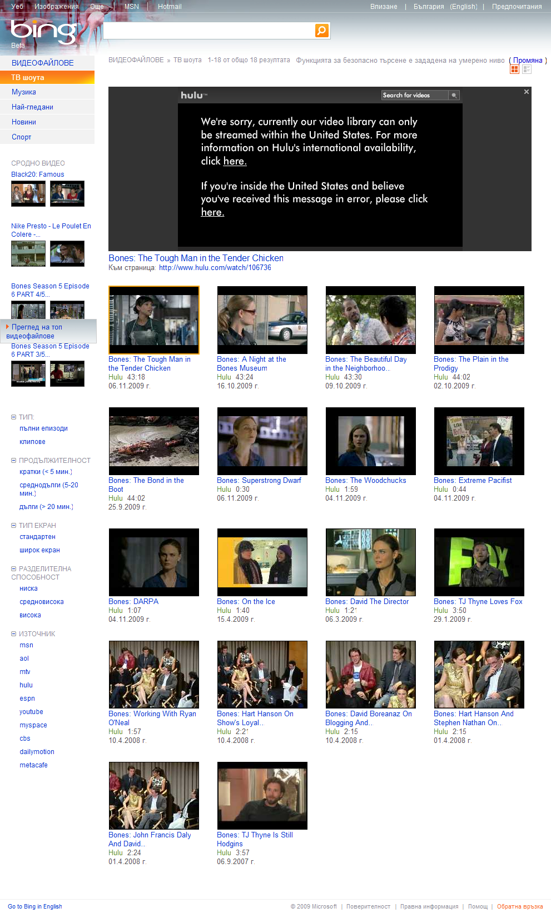

Говори се, че технологиите в момента са развити дотолкова, че например
компании като Google и Microsoft да знаят и майчиното ми мляко. Дори и
да не знаят толкова, поне знаят къде се намирам и на къкъв език искам по
подразбиране да се показват страниците.

И така мисля си, че всичко това би трябвало да спомага на едно по-добро
потребителско преживяване докато не виждам публикация за новата услуга
на Microsoft - Bing Video, цъквам на връзката за да разглеам
по-подробно, виждам приличен видео сайт, започвам да местя курсора над
прегледите на видеотата и, о Боже, те започват направо там - от
прегледа. До тук - идеално.

Цъквам да видя едно от тези клипчета и фрас - **не съм от правилната
държава**. Та въпросът, заради който пускам този пост е: защо като не
съм от правилната държава изобщо мога да избера тази опция и да се
разочаровам? Не е ли по-добре просто да няма такава опция?

Ееех, Мърдок, Мърдок.

