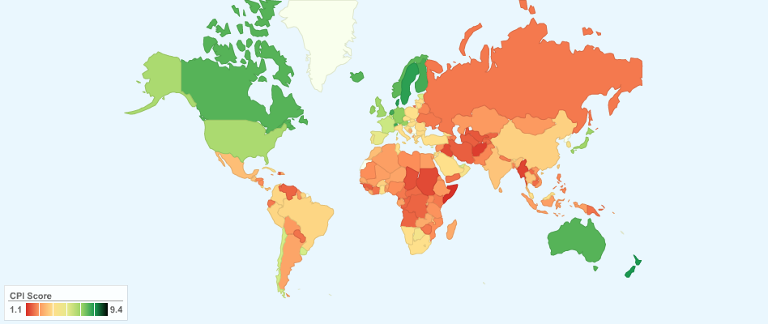

Тази визуализация на корупцията по света е базирана на Corruption
Perceptions Index (CPI) - индекс за възприемане на корупцията.

„Всеки има своята роля, не само правителствата, но също и
парламентаристите, бизнесът, гражданското общество, медиите и
обикновеният гражданин. Корупцията вреди на всички ни и затова трябва
всички да се борим срещу нея“ е цитиран да казва Антонио Мариа Коста,
изпълнителен директор в Отдела за наркотици и престъпления на ООН.

Какво е индексът за възприемане на корупцията - той измерва
възприеманото ниво на корупцията в публичния сектор в 180 страни. Това
всъщност е изследване от изследвания и се базира на 13 различни
експертни и бизнес изследвания.
