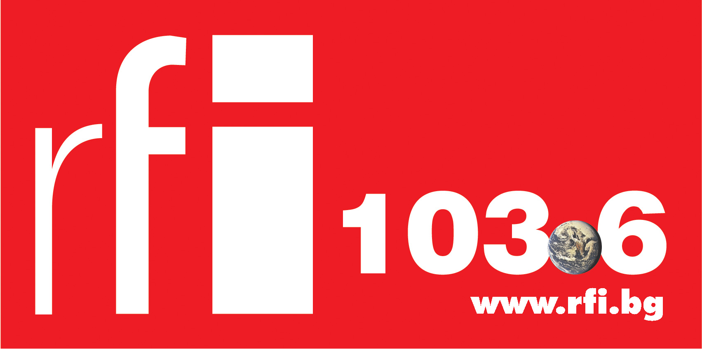

103.6 МНz беше честотата по подразбиране на радиото в колата, така
разбрах, че вече го няма тази вечер - осъзнах, че всъщност слушам радио
Фокус.

RFi винаги е било убежище за културна информация и достоверен източник
на новини. Не знам дали ще бъде така и в бъдещето. Надявам се.
