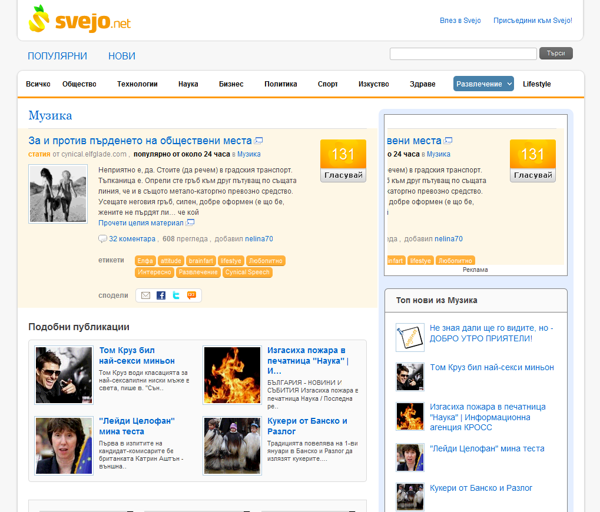

Може би най-популярният български сайт за споделяна не връзки
[Svejo.net](http://svejo.net) излезе с нова версия след пълен редизайн -
с такъв обхват, че напълно успя да ме изненада, а усещането направо
достигна такова за посещение на напълно различен сайт, само че със
същото съдържание и потребители. А ето и как изглежда.

Новият интерфейс е преподреден сериозно в може би по-просто организирани
зони, но местата на някои елементи са променени - това по-скоро
затруднява известно време потребител свикнал къде да търси нужната
функция. Например броят гласували.

Самото гласуване от мястото на подреждане на резултати с връзки е
преработено в бутон гласувай. Логото е по-стабилно, но лимончето се е
превърнало в своя обвивка оформена като латинската буква S. Главното
меню е станало по-компактно и напомня това на
[Digg.com](http://digg.com) - ясно и точно, но бих се радвал да можех да
видя падащите подменюта без допълнително натискане на малкото бутонче.

Друго, което прави впечатление, е промяната на цвета на по-важните
връзки от свежото оранжево към хладното синьо. За щастие оранжевото
просто е сменило форма и функции и не липсва от страницата.

Навигацията е по-скоро подобрена с позиционирането на полето за текстово
търсене и връзките за вход и регистриране. Много, по-скоро полезно,
място за връзките към популярни и нови споделени връзки.

По-скоро приятен редизайн, особено шрифта на логото.
