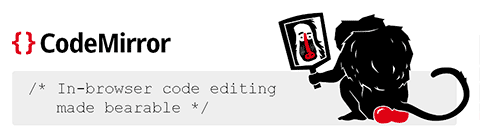

[**CodeMirror**](http://codemirror.net/) е JavaScript библиотека, която
може да се използва при създаването на относително удобен интерфейс за
редактор на компютърен код. Ако съществува парсваща функционалност за
езика, който имате нужда да бъде редактиран онлайн, то кодът му ще бъде
оцветен, а редакторът ще помогне със задаването на отстъпи и
подреждането.

Библиотеката изглежда сериозна и на страницата ѝ се вижда, че се ползва
от някои високоуважавани от мен сайтове.

Разбира се, това не е единственият по рода си или пък най-напредналият
такъв проект. [Bespin](http://labs.mozilla.com/projects/bespin/) на
Mozilla Labs например има амбицията да постигне дори много повече от
това като предостави интегрирана онлайн среда за работа с код, включваща
файлов браузър, панел за редакция на код, конзола за изпълнение и т.н.
