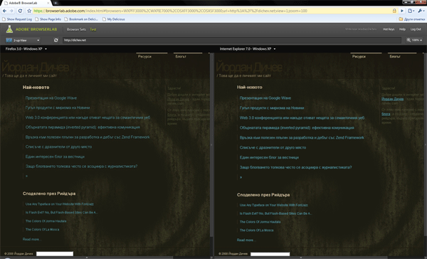

[Adobe BrowserLab](http://browserlab.adobe.com/) може донякъде да спести
усилията по тестването на уеб дизайн на различни браузъри и платформи.

Аз обикновено тествам на най-новите браузъри под уиндоус, а на
по-старите с помощта на предварително подготвени за целта виртуални
машини - става дума за експлорър 6 и 7. Тестването на мак изисква мак,
което още повече усложнява задачата. Тези начини безспорно имат
предимства, тъй като уеб сайтовете и приложенията са все по-сложно
организирани и е добре да те тестват във възможно най-близка до
естествената среда на браузъра.

Ако обаче става дума за това дали дизайнът изглежда ОК под различните
браузъри, тогава това приложение на адобе определено може да свърши
работа.

За да се ползва трябва да имате създаден адобе потребител и парола, а
след вход има само един екран, на който се развива цялото действие.
В полето за адрес трябва да се въведе адреса на страницата, чийто външен
вид може да бъде разглеждан в различните браузъри в режим на преглед:
един екран, два екрана или onion skin (бих си го превел като пластове).

Особено интересен режим е този с пластовете, където чрез дърпане на
плъзгача над екрана за преглед може да се преминава плавно от изгледа на
страницата от един браузър в друг - особено полезно за забелязване на
малки разлики. Те може би са незначителни, но според мен има ситуации в
които са важни и не са за подценяване.
